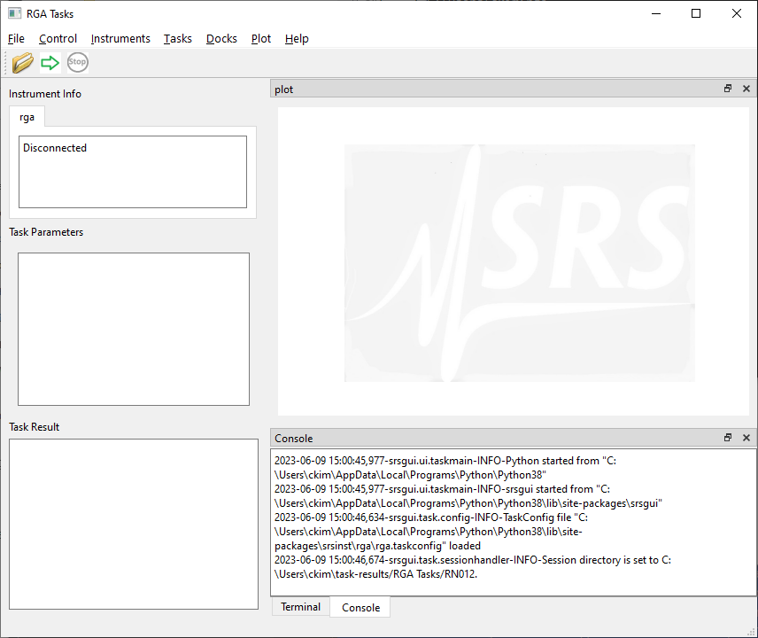

Installation
=============

Preparation
------------

To install ``srsinst.rga``,  make sure you have Python version 3.7 or later.
you can check your Python version by running from the command prompt:

.. code-block::

    python --version

.. note::

    Commands running from the command prompt shown here are assumed using
    a Windows computer system. If you use other systems, commands may be
    different. Refer to `this page. <install-packages_>`_

If you have a Python older than the required version,
`install a newer Python. <install-python_>`_

Using `virtual environment <virtual-environment_>`_ helps to avoid possible dependency
conflicts among Python packages. If you want to use a virtual environment, create one with
your favorite virtual environment package. If you do not have a preference,
use Python default ``venv``.

.. code-block::

    python -m venv env
    .\env\Scripts\activate

.. note::
    Commands to activate ``venv`` are different among computer systems. Other than Windows, refer to
    `this page <venv_>`_.

Installation for instrument driver only
----------------------------------------------

If you need to communicate and acquire data from SRS RGAs along with
basic RGA data handling, you simply need
:class:`RGA100 <srsinst.rga.instruments.rga100.rga.RGA100>` only.

Install ``srsinst.rga`` using pip_ from the command prompt as following.

.. code-block::

    python -m pip install srsgui

It will install ``srsinst.rga`` along with pyserial_, numpy_, and scipy_ main packages.
Sometimes, the newest Python does not have compatible versions of the packages available yet.
Watch out for for any error messages during installation.

If everything goes well, You can proceed to the :ref:`next section<top_of_instrument_driver>`
on how to use it as instrument driver.

Full installation for GUI application
--------------------------------------------

To run ``srsinst.rga`` as a GUI application, install it with [full] option using pip_:

.. code-block::

    python -m pip install srsgui[full]

It will install ``srsinst.rga`` package along with
the 2 additional main packages (matplotlib_ and pyside6_) and their dependencies.
After installation completed, you can start ``srsinst.rga`` as an GUI application.

Starting srsgui application
----------------------------

After ``srsinst.rga`` is installed, you can start ``srsinst.rga`` application from the command prompt.

.. code-block::

    rga

    or

    python -m srsinst.rga

``srsinst.rga`` installs a executable script named "rga" in Python/Scripts directory.
If the directory is included in PATH environment variable, **rga** command will work.
Otherwise, **python -m srsinst.rga** will work regardless of PATH setting.

.. _top-of-initial-screen-capture:

    Srsinst.rga startup window

If you see the application is open and running, the installation is successful!

.. note::
    Instead of seeing the application running, you may get errors, probably ImportError.
    Carefully look through the exception traceback to find out which package causes the error.
    When the latest python is installed, some packages may not be installed properly. If the problem
    is not from ``srsgui`` directly, web search of the problem usually leads to a fix.

.. _install-packages: https://packaging.python.org/en/latest/tutorials/installing-packages/
.. _install-python: https://www.python.org/
.. _virtual-environment: https://realpython.com/python-virtual-environments-a-primer/
.. _venv: https://packaging.python.org/en/latest/guides/installing-using-pip-and-virtual-environments/
.. _pip: https://realpython.com/what-is-pip/
.. _pyserial: https://pyserial.readthedocs.io/en/latest/pyserial.html
.. _numpy: https://numpy.org/doc/stable/user/whatisnumpy.html
.. _scipy: https://docs.scipy.org/doc/scipy/tutorial/general.html
.. _matplotlib: https://matplotlib.org/stable/tutorials/introductory/quick_start.html
.. _pyside6: https://wiki.qt.io/Qt_for_Python
